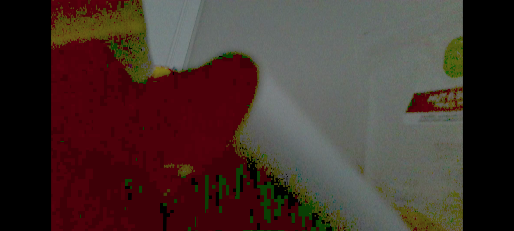
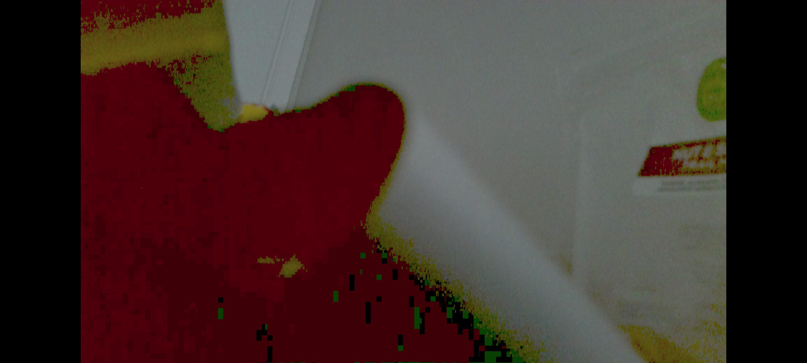

# OBS Denoising Shader

This repository contains a custom **GLSL shader filter** for **OBS Studio** that reduces video noise and smooths frames. It is especially useful for low-light webcam footage or videos with visible color noise.

---

## Features
- Real-time temporal noise reduction.
- Adjustable parameters (blur radius, edge-preserving threshold, etc.)
- Easy to integrate into **OBS Studio** via the *User-defined Shader* filter
- Low-latency rendering

---

## Installation & Usage
## Prerequisite: Install Shader Filter Plugin
OBS Studio does not include the "User-defined Shader" filter by default.  
You need to install the [obs-shaderfilter plugin](https://github.com/exeldro/obs-shaderfilter).
### 1. Download the Shader
Clone or download this repository:
```bash
git clone https://github.com/your-username/your-repo.git
```
Or simply download the `fast_denoise.shader` file.

### 2. Add the Shader in OBS
1. Open **OBS Studio**  
2. Select your **video source** (e.g., your webcam)  
3. Right-click the source → **Filters**  
4. Under **Effect Filters**, click **+** and choose **User-defined Shader**  

### 3. Load the Shader
1. In **Shader file path**, browse and select `denoise.shader` from this repository.  
2. OBS will automatically load the shader.

---

## Showcase
<p float="left">
  
  
</p>


